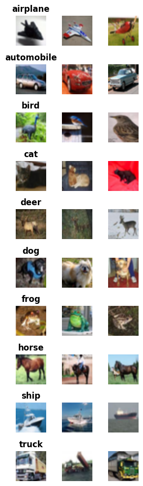
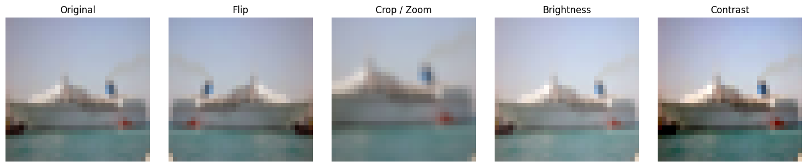
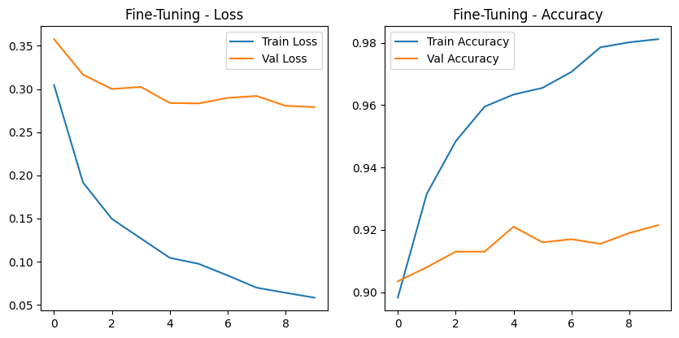
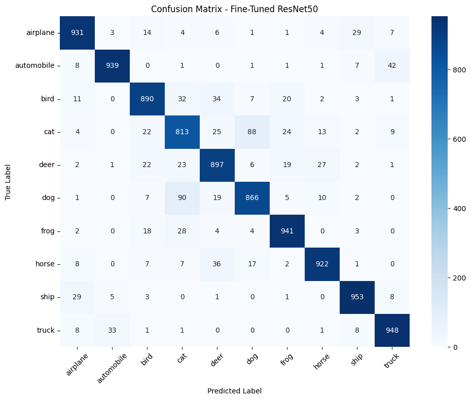

# CIFAR-10 Image Classification with CNN and ResNet50 Transfer Learning

## Project Overview

This project explores image classification on the CIFAR-10 dataset using two different deep learning approaches:

* A custom Convolutional Neural Network (CNN) trained from scratch.
* A transfer learning approach based on a pretrained ResNet50 model.

The objective is to classify RGB images into one of ten mutually exclusive categories and evaluate the impact of transfer learning on low-resolution image classification.

The project includes:

* Exploratory Data Analysis (EDA)
* Data preprocessing
* Baseline CNN modeling
* Transfer learning with ResNet50
* Data augmentation
* Selective fine-tuning
* Error analysis and model evaluation

---

## Final Results

| Model               | Test Accuracy |
| ------------------- | ------------- |
| Baseline CNN        | 60.5%         |
| ResNet50 Head Only  | 88.7%         |
| ResNet50 Fine-Tuned | 91%         |

**Transfer learning improved test accuracy from 60.5% to 91%.**

---

## Dataset

The project uses the CIFAR-10 dataset available through TensorFlow/Keras.

Dataset characteristics:

* 60,000 RGB images
* Image size: 32 × 32 pixels
* 10 classes
* 50,000 training images
* 10,000 test images

Classes:

* Airplane
* Automobile
* Bird
* Cat
* Deer
* Dog
* Frog
* Horse
* Ship
* Truck

To reduce training time on local hardware, the training dataset was limited to 10,000 images.

---

## Dataset Samples



Visual inspection revealed:

* High intra-class variability
* Different viewpoints and object scales
* Complex and inconsistent backgrounds
* Limited visual detail due to the 32×32 resolution

These characteristics make CIFAR-10 a challenging image classification benchmark.

---

## Methodology

### 1. Exploratory Data Analysis

The EDA phase focused on:

* Class distribution
* Sample visualization
* RGB channel analysis
* Pixel intensity distributions

The dataset was found to be well balanced across all classes.

---

### 2. Baseline CNN

A custom CNN was implemented to establish a performance baseline.

Architecture:

* Conv2D (32) + MaxPooling
* Conv2D (64) + MaxPooling
* Conv2D (128) + MaxPooling
* Dense (128)
* Dropout
* Softmax Output Layer

Total trainable parameters:

**~357,000**

The CNN was trained directly on the original 32×32 images.

---

### 3. Transfer Learning with ResNet50

A pretrained ResNet50 model was used as the feature extraction backbone.

Pipeline:

```text
Input Image
     ↓
Resize to 224×224
     ↓
ResNet50 Preprocessing
     ↓
Pretrained ResNet50 Backbone
     ↓
Custom Classification Head
     ↓
Prediction
```

Custom classification head:

* GlobalAveragePooling2D
* Dense (256)
* Dropout (0.5)
* Softmax Output Layer

Total model parameters:

**~24 million**

---

### 4. Training Strategy

The transfer learning workflow consisted of two stages.

#### Stage 1 — Head-Only Training

* ResNet50 backbone frozen
* Only the custom classification head trained

Result:

**88.7% test accuracy**

#### Stage 2 — Selective Fine-Tuning

* Early ResNet50 layers remained frozen
* Deeper layers were unfrozen
* Smaller learning rate applied

Additional techniques:

* Data augmentation
* Dropout regularization
* ReduceLROnPlateau callback

Result:

**91% test accuracy**

---

## Data Augmentation

To improve generalization and reduce overfitting, several augmentation techniques were applied:

* Random horizontal flip
* Random crop / zoom
* Brightness variation
* Contrast variation



These transformations increase visual diversity without changing image labels.

---

## Fine-Tuning Performance



The training curves show stable convergence during fine-tuning and good validation performance throughout training.

---

## Error Analysis

### Confusion Matrix



The confusion matrix shows strong performance across most classes.

Most errors occur between visually similar categories, including:

* Cat ↔ Dog
* Automobile ↔ Truck
* Horse ↔ Deer

These mistakes are expected due to:

* Low image resolution
* Similar textures and shapes
* Ambiguous viewpoints
* Missing contextual information

---

## Key Findings

* Transfer learning significantly outperformed the baseline CNN.
* Pretrained ImageNet features transferred effectively to CIFAR-10.
* Data augmentation improved generalization.
* Selective fine-tuning provided additional performance gains.
* Error analysis revealed meaningful semantic confusions rather than random failures.

---

## Project Structure

```text
cifar10-image-classification/
│
├── notebooks/
│   ├── 01_gathering_eda.ipynb
│   └── 02_preprocessing_modeling_evaluation.ipynb
│
├── images/
│   ├── dataset_samples.png
│   ├── augmentation.png
│   ├── resnet_finetuning.png
│   └── confusion_matrix.png
│
├── presentation/
│   └── computer_vision_image_classification.pdf
│
├── README.md
├── requirements.txt
└── .gitignore
```

---

## Technologies Used

* Python
* TensorFlow / Keras
* NumPy
* Pandas
* Matplotlib
* Seaborn
* Scikit-Learn

---

## Installation

Clone the repository:

```bash
git clone https://github.com/your-username/cifar10-image-classification.git
cd cifar10-image-classification
```

Install dependencies:

```bash
pip install -r requirements.txt
```

---

## Running the Project

Open the notebooks in the following order:

1. `01_gathering_eda.ipynb`
2. `02_preprocessing_modeling.ipynb`

---

## Limitations

* Only 10,000 training images were used.
* Training was limited by local hardware resources.
* ResNet50 is relatively large for CIFAR-10.

---

## Future Improvements

* Train on the full CIFAR-10 dataset
* Experiment with EfficientNet architectures
* Explore Vision Transformers (ViTs)
* Apply stronger augmentation strategies
* Perform hyperparameter optimization

---

## Conclusion

This project demonstrates how transfer learning can dramatically improve image classification performance on low-resolution datasets.

Despite using only a 10,000-image training subset, the fine-tuned ResNet50 achieved more than 91% test accuracy, significantly outperforming a CNN trained from scratch.

The results highlight the effectiveness of pretrained visual representations, data augmentation, and selective fine-tuning in modern computer vision workflows.

